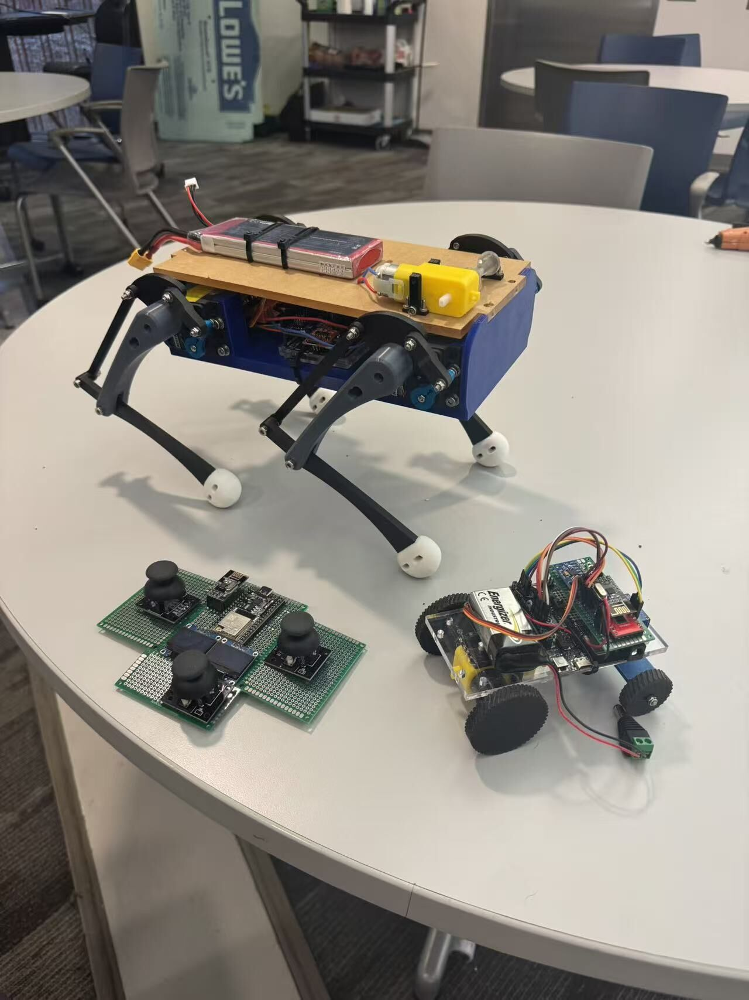
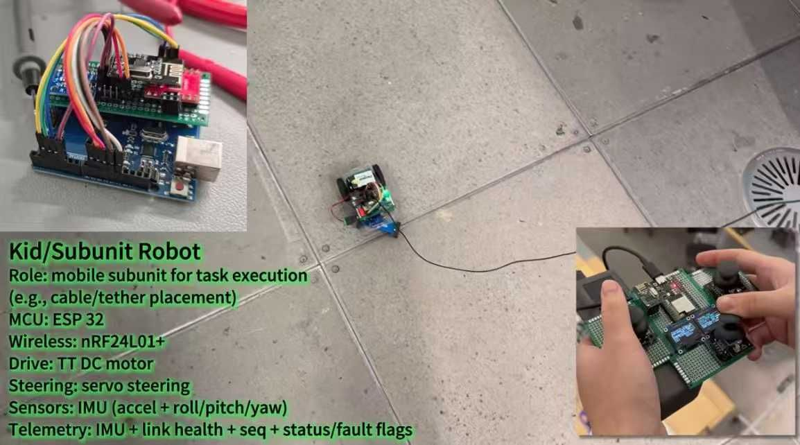
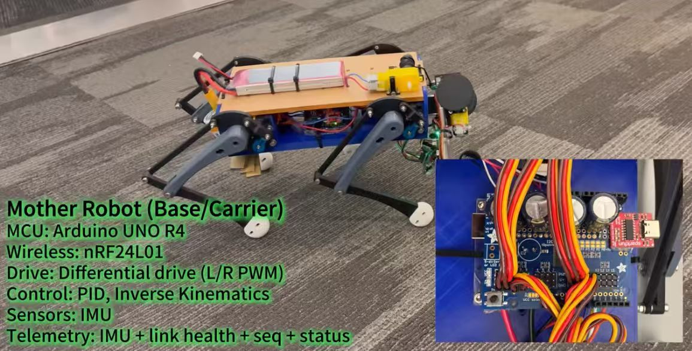
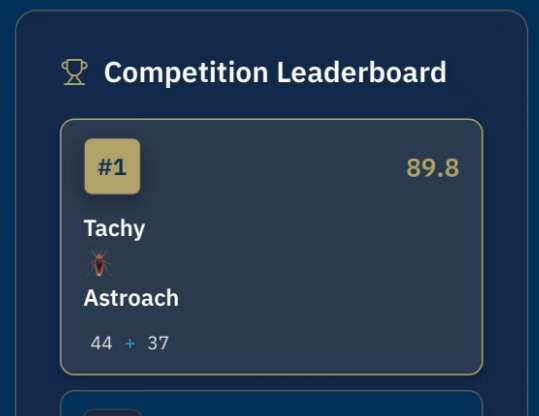

36 小时的冲刺。

沉浸在 Tough 2000 树脂、姿态控制、ISO 螺栓和总线通信的世界里——我们将原材料变成了一辆外星漫游车。

GT IEEE Robotech 黑客马拉松或许不是规模最大的赛事，但它是我第一次真正投身于高强度黑客马拉松式的构建。尽管外面冻雨和大风肆虐，大家都到场了。我们的四人团队 TachyAstroach 正式开启任务。

**计划：** 构建一个母子漫游车系统——"母车"发射"子单元"，两者通过定制驱动和弹射机构进行无线协调。

我主导了大部分 Fusion 360 机械设计工作，与负责电子、控制算法和通信接口的队友密切协作。（更多细节可查看我们的 [DevPost 页面](https://devpost.com)。）

与如此优秀的队友合作是一种纯粹的享受——那种信任感让你可以在编程和 CAD 之间无缝切换。

疲惫？绝对是。但也非常充实。靠着 Lidl 无糖可乐和团队协作，我们彻夜进行 CAD 设计、切割、焊接、编程和调试。

最终结果：一个可运行的漫游车原型，以及令我们惊喜的——在竞赛赛道中荣获**第一名**，获得 **$1,000 奖金**。

没有 **Peijie Liu** 的电路魔法、**Zerun Wang** 的控制逻辑，以及 **Aimee Yu Ting Zheng** 最后关头救场的编辑魔力，这一切都不可能实现。

这个项目再次提醒我为何热爱实践原型开发——快节奏、高强度，乐在其中。

这辆月球车，确实令人震撼。
