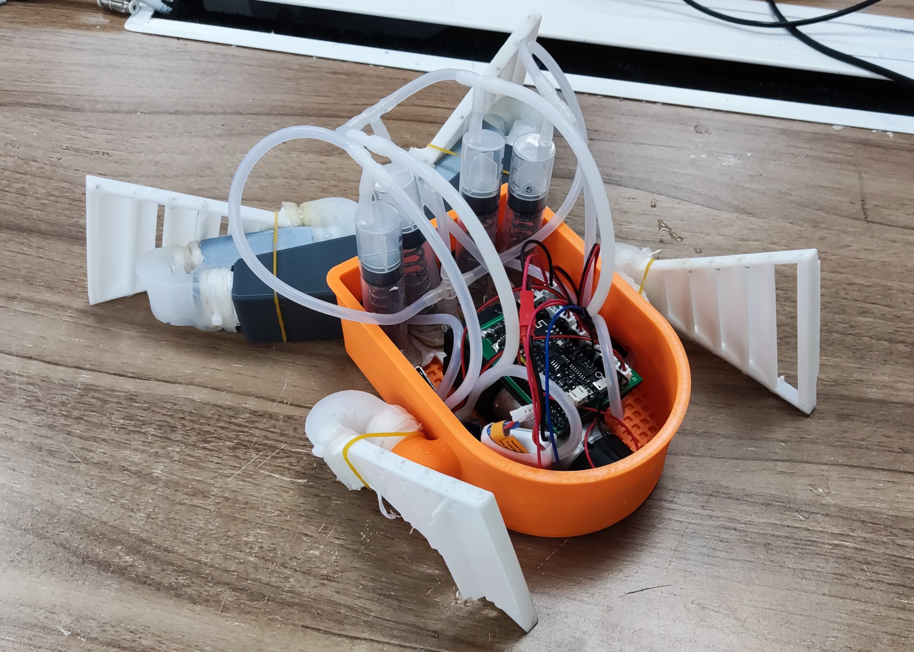
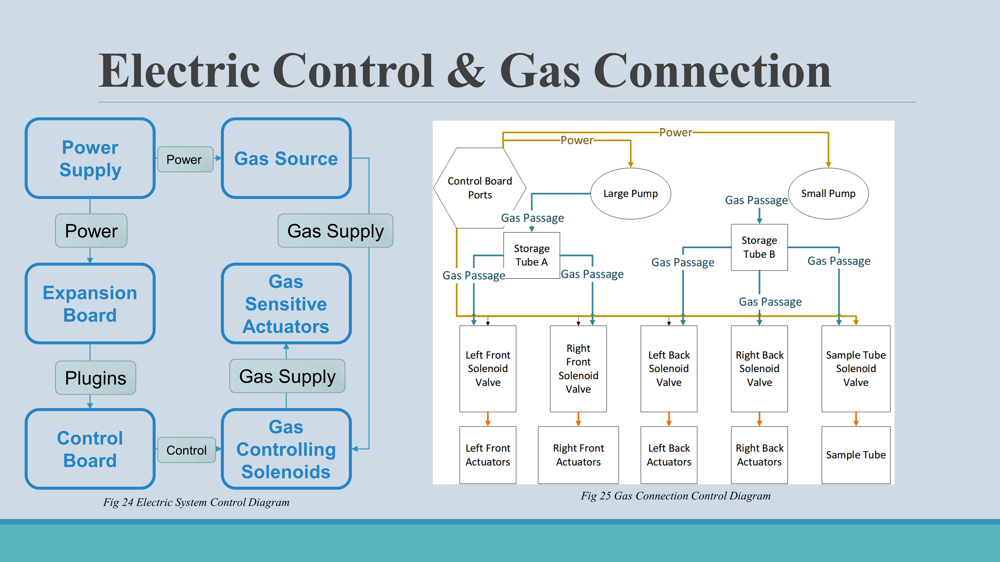
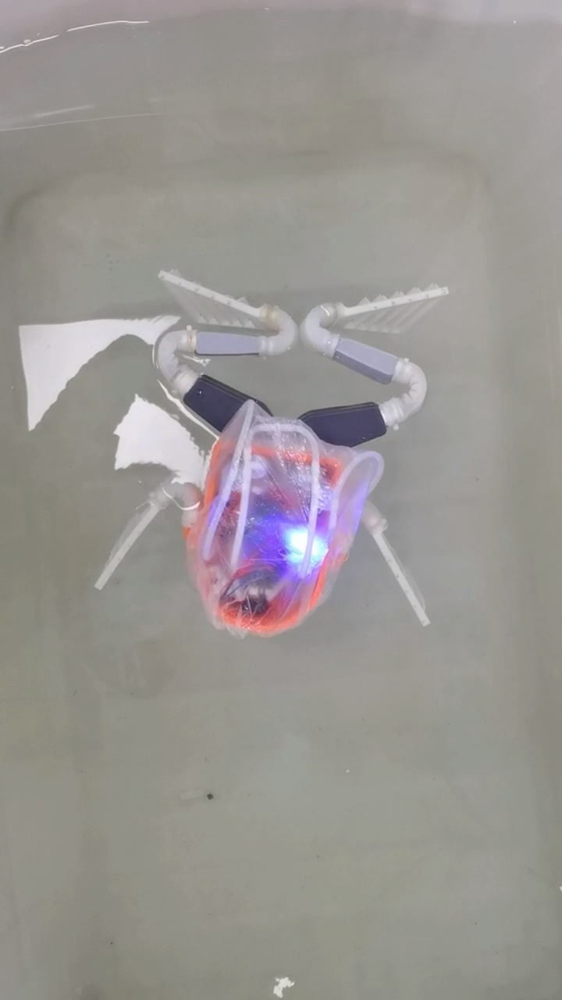
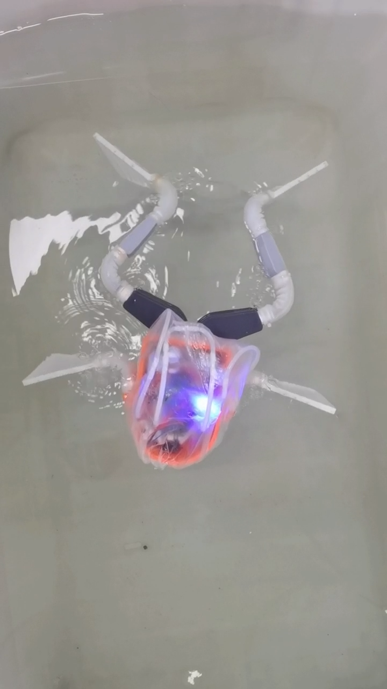
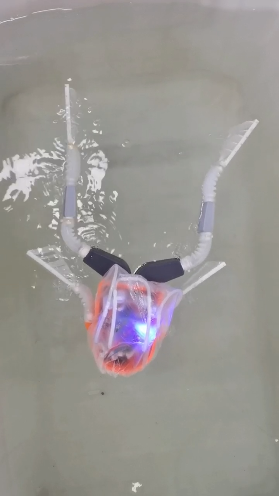
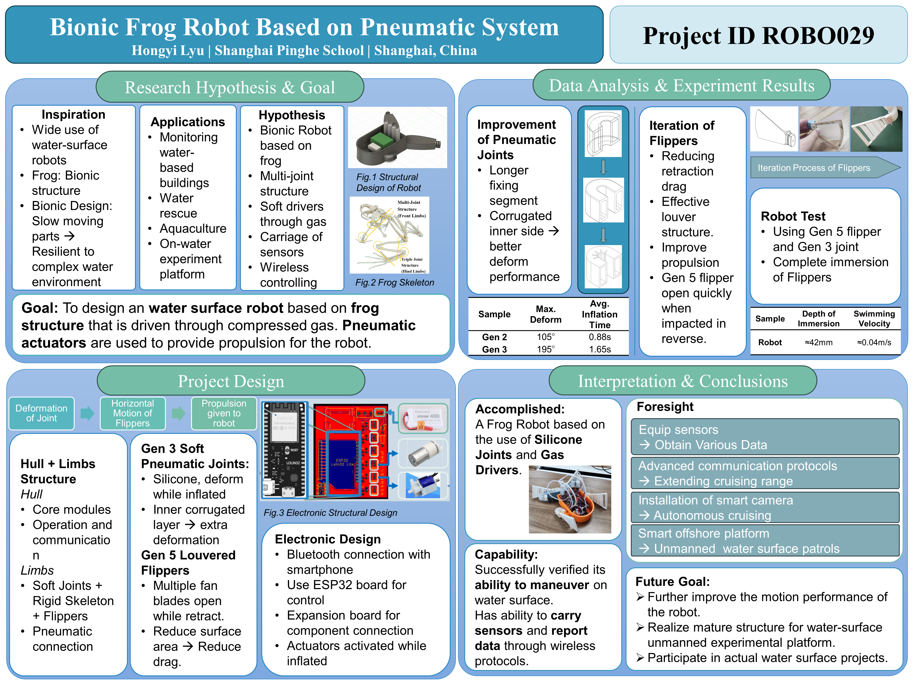


Another Way to Swim: A Lightweight Bionic Frog Robot Based on Pneumatic System


## Overview

This project presents a lightweight **bionic frog robot** driven by compressed gas through pneumatic soft-body actuators. Designed to mimic the swimming motion of a frog, the robot operates on the water surface using inchworm-shaped silicone joints that deform under internal air pressure — generating propulsion and enabling directional control.

The project was presented at the **Regeneron International Science and Engineering Fair (ISEF) 2024** in Los Angeles as part of the China national team delegation, under Project ID **ROBO029** in the *Robotics and Intelligent Machines* category.

## Research Motivation

Water-floating robots with surface maneuverability can serve as effective platforms for aquatic research, environmental monitoring, and water sampling. Unlike rigid-bodied underwater robots, soft-body pneumatic actuators offer:

- **Compliance** — safe interaction with aquatic environments
- **Lightweight construction** — suitable for surface operation
- **Biomimetic locomotion** — efficient swimming gait inspired by real frogs

## System Architecture

The robot consists of two main subsystems: a **control module** housed in the main body and a **motion module** distributed across the four limbs.

### Pneumatic System
- **Dual air pumps** (large + small) feed pressurized air through storage syringes
- **5 solenoid valves** independently control four limb joints and one sampling cavity
- Pneumatic lines route through the body to each silicone soft-body joint
- Controller board manages valve sequencing for coordinated swimming gaits

### Soft-Body Actuators
- **Gen 5 silicone soft-body joints** — inchworm-shaped pneumatic actuators
- Multi-layer construction with embedded constraints for controlled deformation
- Louvered flipper design for asymmetric drag (power stroke vs. recovery stroke)
- Went through **multiple design iterations** with soft-body simulation, component testing, and full machine validation

### Electronics & Control
- **Low-power ESP32-based** control board
- Bluetooth connectivity for wireless operation via smartphone
- Expansion board kit for sensor integration
- Solenoid valve actuation timing controlled via firmware

## Swimming Performance

The robot achieves a static water movement speed of approximately **0.04 m/s** through coordinated limb actuation. Direction control is realized by differential timing of left and right limb strokes.

## Quad Chart

## Key Results

- Successfully verified the robot's ability to **maneuver on the water surface**
- Capable of carrying a **sampling tube** for water data collection
- Wireless control via **Bluetooth smartphone interface**
- Sensor data reporting through onboard telemetry

## Future Goals

- Improve motion performance through refined soft-body joint geometry
- Optimize the resilient structure for greater water-surface compliance
- Expand commercial and educational platform potential
- Participate in further surface water robotics research

## ISEF Display Board

