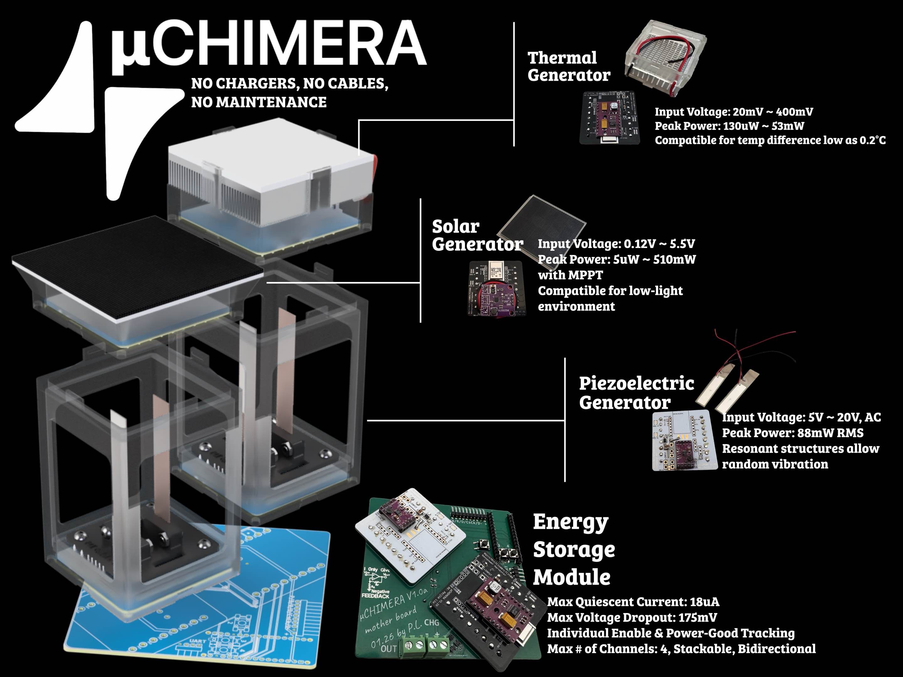
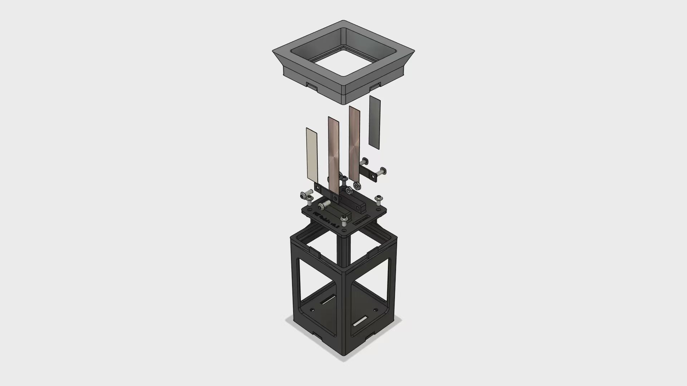
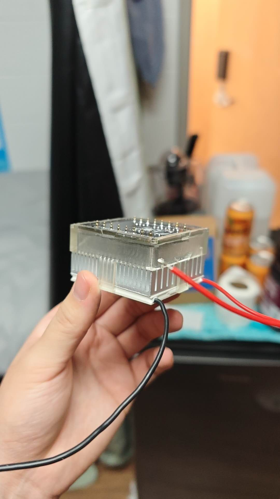
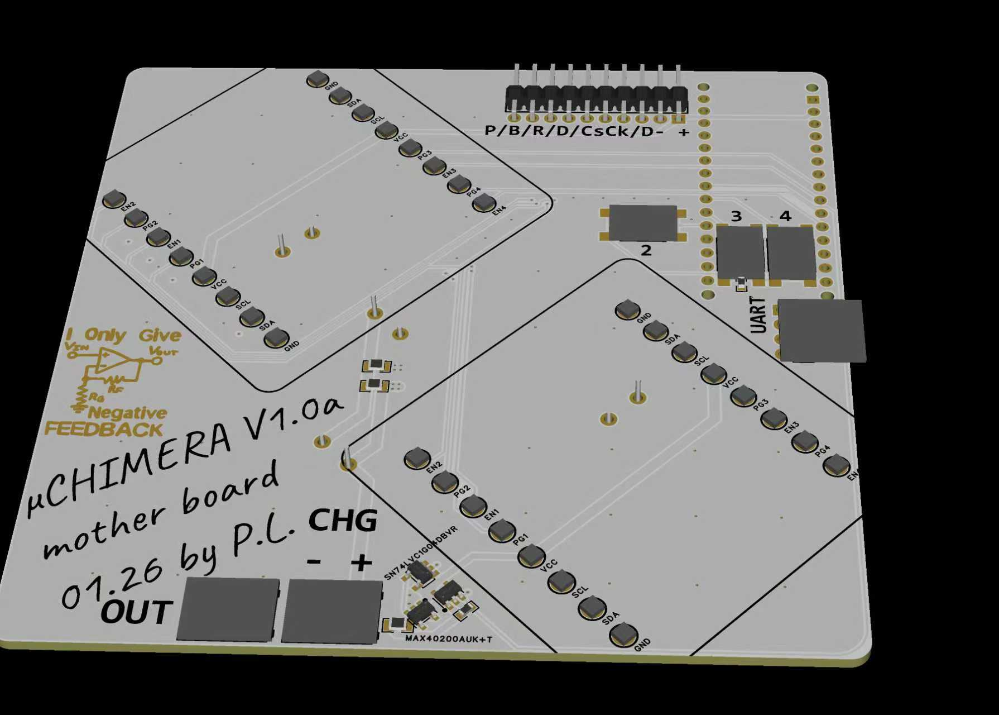
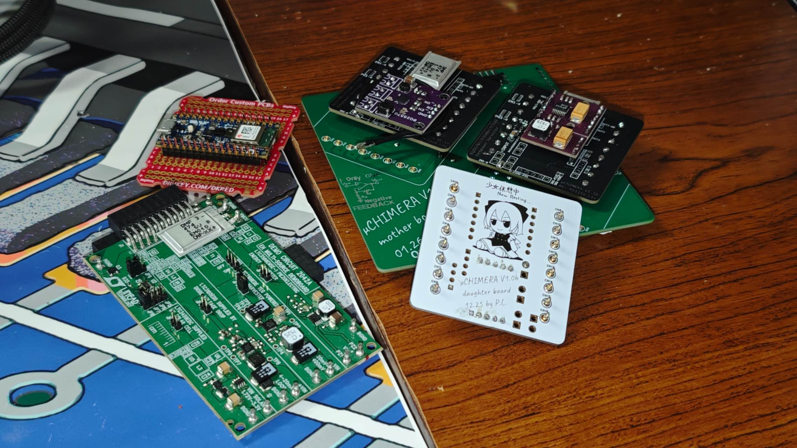


No chargers. No cables. No maintenance.


## What is μCHIMERA?

**μCHIMERA** (micro Composite Harvesting Integrated Modular Energy Regeneration Array) turns ambient energy into a reliable power supply, so devices can stay on without charging, wires, or maintenance.

Every "always-on" device has the same hidden failure point: not the sensor, not the chip — but the energy supply. The structural inefficiencies of charging infrastructure for industrial systems, wearables, and medical implants cause downtime and safety risks. μCHIMERA eliminates that dependency entirely.

## The Problem

Current solutions fall short:

- **Finite batteries** — require scheduled replacement, creating downtime and waste
- **Single-source harvesters** — fail when their one energy source is unavailable
- **RF power** — fragile, range-limited, and infrastructure-dependent

μCHIMERA addresses all three by combining multiple harvesting modalities into one integrated module.

## System Architecture

The system integrates three complementary energy harvesting sources into a single modular platform:

### Thermal Generator (TEG)
- **Input Voltage:** 20mV ~ 400mV
- **Peak Power:** 130μW ~ 53mW
- Compatible with temperature differences as low as 0.2°C

### Solar Generator
- **Input Voltage:** 0.12V ~ 5.5V
- **Peak Power:** 5μW ~ 510mW with MPPT
- Optimized for low-light environments

### Piezoelectric Generator
- **Input Voltage:** 5V ~ 20V AC
- **Peak Power:** 88mW RMS
- Resonant structures designed for random vibration harvesting

### Energy Storage Module
- **Max Quiescent Current:** 18μA
- **Max Voltage Dropout:** 175mV
- Individual enable & power-good tracking
- Up to 4 channels, stackable, bidirectional

## Hardware

The electronics are built around custom PCBs designed by Peijie Liu, featuring the μCHIMERA V1.0a motherboard and stackable daughter boards for each energy harvesting channel.

## Key Features

- **Versatile & Adaptive** — harvests from thermal gradients, light, and vibration simultaneously
- **Safe & Durable** — no lithium dependency for primary energy input
- **Infrastructure-Independent** — no charging stations, cables, or grid access required

## Target Markets

1. **Industrial IoT Sensors** — eliminate battery swaps and downtime in remote sensor deployments
2. **Wearables** — no-charging design drives user compliance and enables continuous data collection
3. **Medical Devices & Implants** — extended longevity reduces costly and risky replacement procedures

## Market Opportunity

The energy harvesting market is scaling at ~11.6% CAGR, projected to reach ~$1.6B by 2033. Our opportunity: TAM ~$1.6B (2033), SAM ~$216M, and SOM ~$240.7M in the U.S. beachhead by 2028.

## Business Model

- **Hardware modules** sold through OEMs, distributors, and direct pilots
- **Starter kit** at $129.99 per unit
- **Recurring revenue** from add-on harvesting modules at $59.99 each

## Roadmap

1. **Prototype & Validation** — current phase
2. **2026 Design-Partner Pilots** — early adopter deployments
3. **Paid Deployments** — convert pilots to production orders
4. **Scale** — expand via OEM partnerships and system integrators

## Impact

By cutting battery waste and enabling always-on devices for health, infrastructure, and sustainable cities, μCHIMERA promotes cleaner energy, safer systems, and lower emissions.
