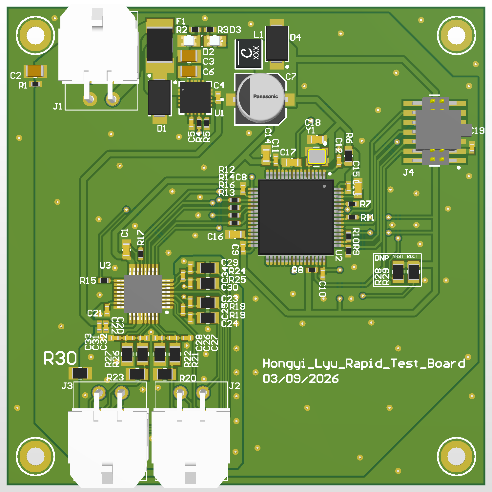
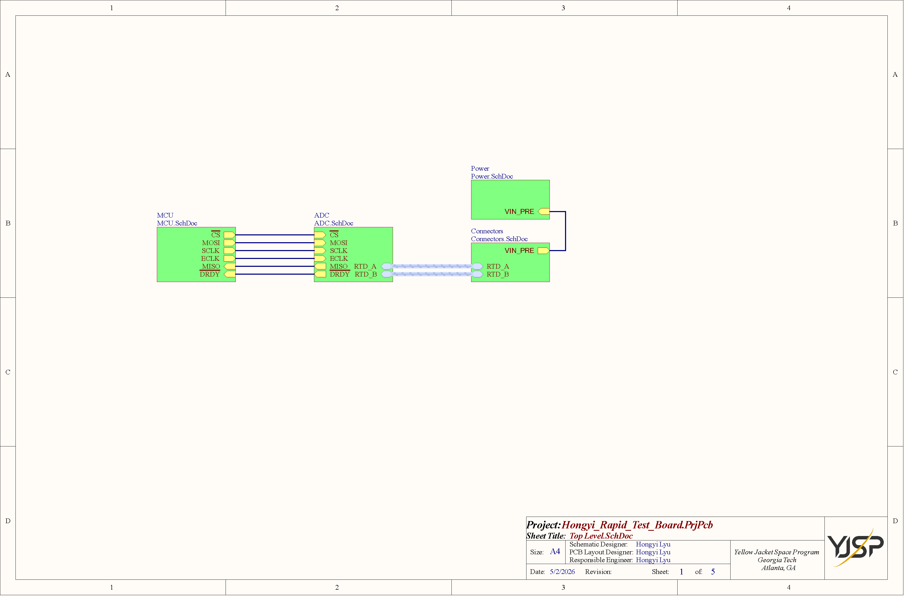
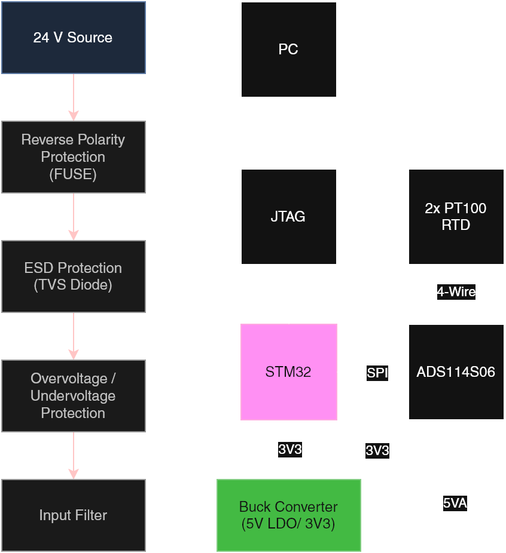
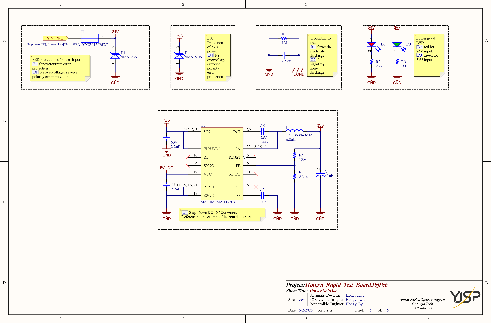
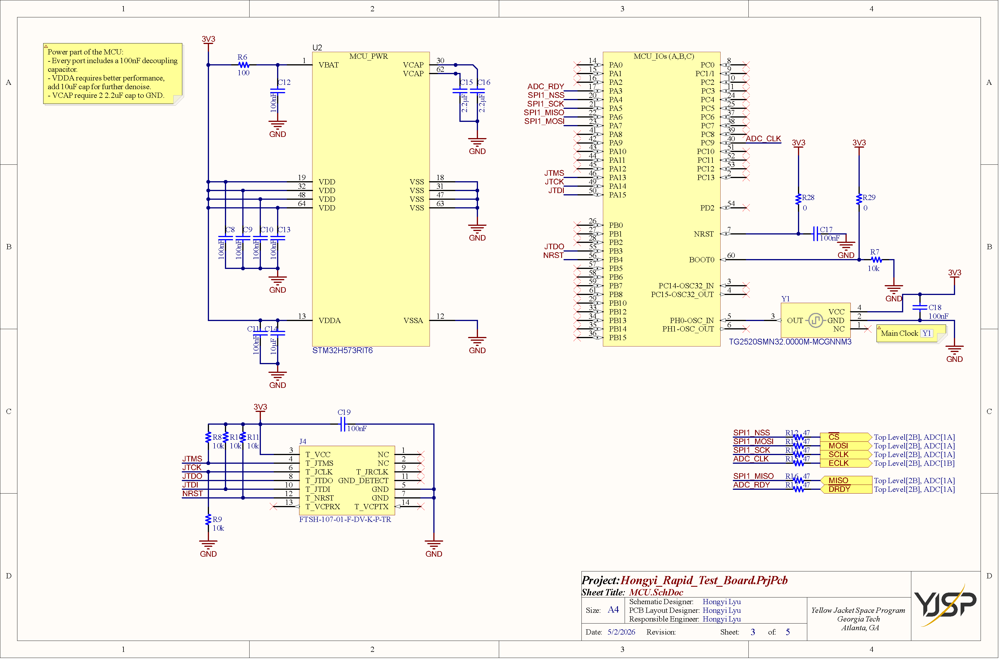
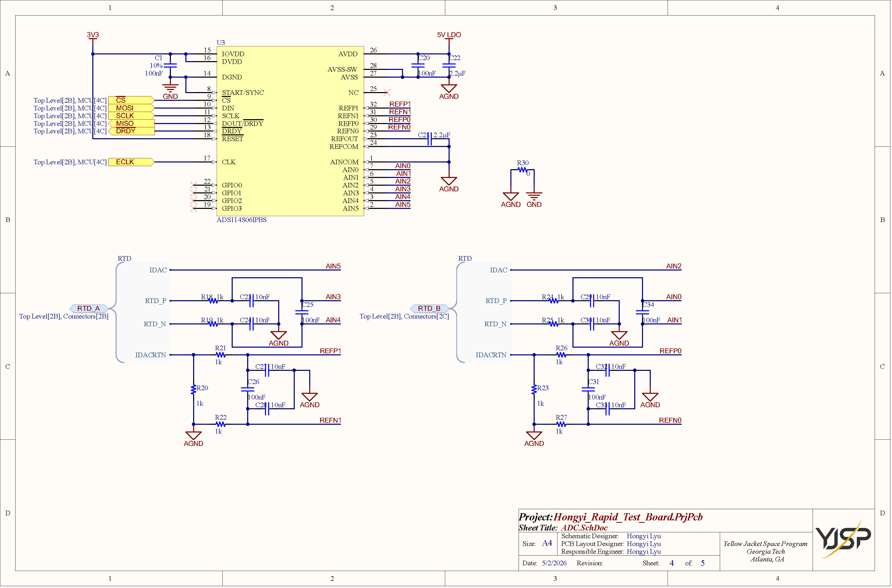
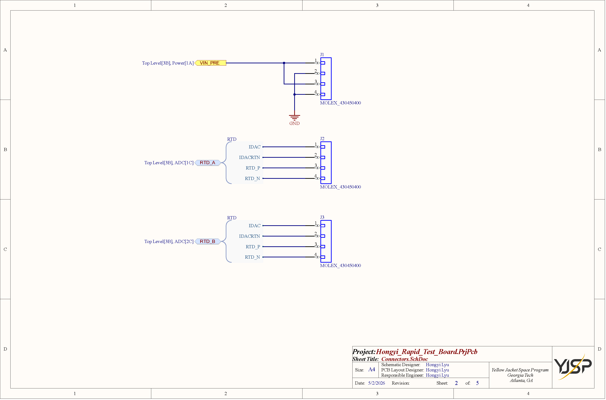
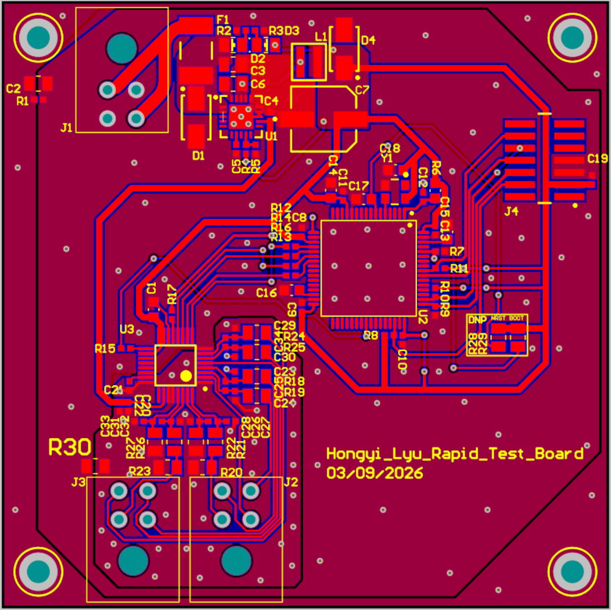
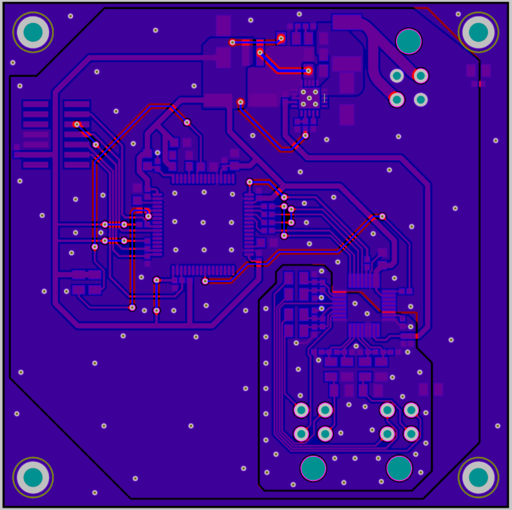
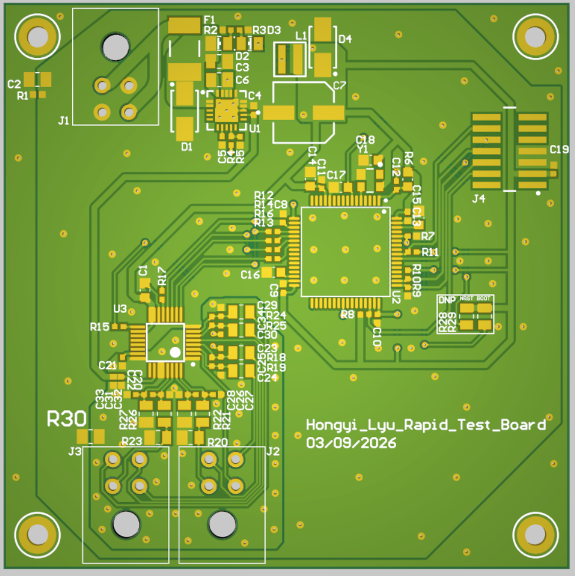


为火箭硬件在环（HITL）测试设计的 STM32 双通道高精度 RTD 温度采集系统。


## 概述

本项目是 Yellow Jacket 太空计划（YJSP）航电部门入职项目的一部分。目标是设计一块 2 层快速测试板，将 STM32H573 微控制器与 ADS114S06 高精度 ADC 集成，用于四线制 PT100 RTD 温度测量，并配套从 24V 输入的完整电源调节链路。

该板作为使用 Altium Designer 培训航电 PCB 设计技能的平台，也是进入硬件在环（HITL）部门的跳板。

## 系统架构

设计采用 Altium Designer 的层次化原理图结构，组织为由顶层图管理的四个子图：

**电源（Power.SchDoc）** — 24V 输入配保险丝过流保护、TVS 二极管用于 ESD 和过压/反接保护、GND 到 CGND 噪声泄放网络，以及 MAX17503 降压 DC-DC 转换器，提供 3.3V（主轨）和 5V LDO（模拟电源）。24V 和 3.3V 轨的电源状态 LED 指示。

**MCU（MCU.SchDoc）** — STM32H573RIT6（ARM Cortex-M33，250 MHz），配完整去耦网络（VDD/VSS 上六个 100nF 电容，VDDA 上 10nF，VCAP 上 2.2µF），32 MHz 外部晶振（TG2520SMN32.0000M-MCGNNM3），经 FTSH-107-01-F-DV-K-P-TR 14 针连接器的 JTAG 调试接口，以及 SPI 总线上串接 47Ω 电阻（CS、MOSI、SCLK、ECLK、MISO、DRDY）用于信号完整性。

**ADC（ADC.SchDoc）** — ADS114S06IPBS 16 位 delta-sigma ADC，双电源域（IOVDD/DVDD 用 3.3V 数字电源，AVDD 用 5V LDO 模拟电源），独立 AGND 平面，两路四线制 RTD 前端电路，每路模拟输入配 RC 滤波（1kΩ + 10nF/100nF），以及 0Ω 电阻（R30）桥接 AGND 至 GND。

**连接器（Connectors.SchDoc）** — MOLEX 430450400 4 针连接器，分别用于 24V 电源输入（J1）、RTD 通道 A（J2）和 RTD 通道 B（J3）。每个 RTD 连接器引出 IDAC、IDACRTN、RTD_P 和 RTD_N 信号。

## 电源设计

### 输入保护

24V 输入通过 BEL 0ZCG0150BF2C 保险丝（F1）进行过流保护，然后经过两个 TVS 二极管：

**D1（SMAJ26A）** — 箝位在 24V 输入到 GND 之间。提供过压箝位和反接错误保护。若输入电压超过击穿阈值或反接，D1 箝位电压并熔断保险丝，保护下游电路。

**D4（SMAJ5.0A）** — 箝位在 3V3 轨到 GND 之间。专为 3.3V 电源域提供 ESD 保护和过压/反接错误保护。

### 接地与噪声泄放

接地网络在电源地（GND）和机壳地（CGND）之间提供静电泄放和高频噪声滤波：

**R1（1MΩ）** — 连接 GND 至 CGND，为静电泄放提供受控路径，同时在直流下保持两个地域的隔离。

**C2（4.7nF）** — 与 R1 并联，为 GND 和 CGND 之间的高频噪声提供低阻抗路径，将瞬态能量分流至机壳。

### 降压转换器（24V → 3.3V）

Maxim MAX17503 降压 DC-DC 转换器直接将 24V 输入转换为 3.3V 输出。原理图遵循数据手册参考设计。关键元器件：

**输入级** — C3（2.2µF，50V）提供输入去耦。EN/UVLO 引脚设置输入欠压锁定阈值。引脚 12（VCC）的 5V LDO 输出为内部栅极驱动和控制逻辑供电，C4（2.2µF）为旁路电容。

**输出级** — L1（XGL3530-682MEC，6.8µH）为连接至 Lx 开关输出（引脚 17-19）的功率电感。C7（47µF）为大容量输出电容。输出电压通过 FB 引脚上由 R4（100kΩ）和 R5（37.4kΩ）组成的反馈分压电阻设置为 3.3V。

**辅助** — BST 引脚上的 C6（100nF，50V）为自举电容，高侧 MOSFET 栅极驱动所需。SS 引脚上的 C5（10nF）设置软启动斜坡时间，限制上电时的浪涌电流。RT 引脚悬空（使用内部默认开关频率）。CF 引脚电容用于环路稳定性补偿。

### 电源状态指示

两个 LED 提供可视电源状态指示：D2（红色）在 24V 输入存在时点亮，D3（绿色）在 3.3V 输出激活时点亮。R2（2.2kΩ）和 R3（100Ω）分别为对应的限流电阻。

## MCU：STM32H573RIT6

### 电源与去耦

MCU 电源网络遵循数据手册建议，对每个电源域仔细处理。每个 VDD 引脚（引脚 19、32、48、64）就近布置 100nF 陶瓷电容（C8-C10、C13）。VDDA 模拟电源（引脚 13）通过 100nF（C11）和 10nF（C14）双电容额外滤波，抑制内部 ADC 参考的高频噪声耦合。VCAP 引脚（引脚 30、62）需要 2.2µF 电容（C15、C16）用于内部稳压器。VBAT（引脚 1）通过 R6（100Ω）连接至 3.3V，并配 C12（100nF）用于备份域滤波。MCU_PWR 网络标注提醒每个端口需独立的 100nF 去耦电容，且 VDDA 额外受益于 10nF 滤波。

### 时钟源

外部 32 MHz 晶振（TG2520SMN32.0000M-MCGNNM3，标记为 Y1）提供系统时钟，连接至 PH0-OSC_IN（引脚 5）和 PH1-OSC_OUT（引脚 6）。晶振从 3.3V（VCC，引脚 3）供电，C18（100nF）为旁路电容。可选的 32 kHz 辅助振荡器输入在 PC14-OSC32_IN（引脚 3）和 PC15-OSC32_OUT（引脚 4）上可用，但在本设计中悬空。

### 复位与启动配置

NRST 引脚（引脚 7）连接 C17（100nF）到 GND，用于上电复位滤波。BOOT0 引脚（引脚 60）通过 R7（10kΩ）拉至 GND，确保 MCU 在正常运行时从内部 Flash 启动。

### JTAG 调试接口

使用 FTSH-107-01-F-DV-K-P-TR 14 针连接器（J4）实现完整 JTAG 接口，同时支持 JTAG 和 SWD 协议。JTMS、JTCK、JTDO、JTDI 和 NRST 信号通过 10kΩ 串联电阻（R8-R11 用于信号线，R9 用于 NRST）进行 ESD 保护和信号调理。C19（100nF）为 T_VCC 电源引脚提供本地去耦。连接器还包含用于调试器存在检测的 GND_DETECT，以及追踪端口功能的 T_VCPRX/T_VCPTX。

### SPI 总线接口

连接至 ADS114S06 的 SPI1 总线信号通过 47Ω 串联电阻（R12-R16）进行阻抗匹配和信号完整性处理。信号映射如下：

| MCU 网络 | 串联电阻 | ADC 信号 | 方向 |
|---------|---------|---------|-----|
| SPI1_NSS | R12 (47Ω) | CS | MCU → ADC |
| SPI1_MOSI | R13 (47Ω) | MOSI | MCU → ADC |
| SPI1_SCK | R14 (47Ω) | SCLK | MCU → ADC |
| ADC_CLK | R15 (47Ω) | ECLK | MCU → ADC |
| SPI1_MISO | R16 (47Ω) | MISO | ADC → MCU |
| ADC_RDY | R17 (47Ω) | DRDY | ADC → MCU |

ADC_CLK 线由 MCU 的 PC9 引脚（引脚 40）驱动，为 ADS114S06 提供外部时钟源。R28 和 R29（0Ω，占位符，待选值）为可选上拉配置，连接 3.3V 轨至 ADC SPI 接口。PD2（引脚 54）标注为可用备用 GPIO。

## ADC：ADS114S06IPBS

### 电源域

ADS114S06 采用分离电源域运行，将数字噪声与敏感模拟前端隔离。IOVDD（引脚 15）和 DVDD（引脚 16）由 3.3V 数字轨供电，C1（100nF，10% 容差）为本地旁路电容。DGND（引脚 14）连接至数字 GND 平面。模拟电源 AVDD（引脚 26）由 MAX17503 的 5V LDO 输出供电，C20（100nF）和 C22（2.2µF）旁路。AVSS（引脚 27-28）连接至专用 AGND 平面，该平面通过 R30（0Ω）单点连接桥接至 GND。此星形接地拓扑防止数字回流电流流经模拟地平面。

### SPI 与控制接口

数字接口信号（CS、MOSI、SCLK、MISO、DRDY、ECLK）通过层次化图连接器从 MCU 图引入，每路在 MCU 侧均已通过 47Ω 串联电阻预处理。START/SYNC 引脚（引脚 8）直接连接，RESET 引脚（引脚 18）直接连接用于 MCU 控制复位。DRDY 输出（引脚 13）低电平有效中断，直接有效。引脚 12（DOUT/DRDY）在单引脚上提供多路复用数据输出和准备信号。

### 参考配置

ADC 对 RTD 测量使用外部比率参考。两路 RTD 通道使用两组独立参考对：REFP1/REFN1（引脚 32/31）用于 RTD 通道 A，REFP0/REFN0（引脚 30/29）用于 RTD 通道 B。REFOUT（引脚 23）和 REFCOM（引脚 24）内部参考输出通过 C21（2.2µF）旁路，但主测量参考来源于流过 RTD 前端电路参考电阻的 IDAC 激励电流。

### 模拟输入通道与 RTD 前端

每路 RTD 通道使用专用模拟前端电路，在每条信号路径上进行 RC 滤波，在到达 ADC 输入之前滤除高频干扰。

**通道 A（RTD_A）** 使用 AIN3/AIN4 进行电压检测，AIN5 用于 IDAC 激励，REFP1/REFN1 为参考对：

| 信号 | ADC 引脚 | 滤波器 | 功能 |
|-----|---------|-------|------|
| RTD_P → AIN3 | 引脚 4 | R18 (1kΩ) + C24 (10nF) + C25 (100nF) | 正电压检测 |
| RTD_N → AIN4 | 引脚 3 | R19 (1kΩ) + C23 (10nF) | 负电压检测 |
| IDAC → AIN5 | 引脚 2 | — | 激励电流输出 |
| IDACRTN → REFP1 | R21 (1kΩ) + C27 (10nF) | 激励电流回路 / 参考正端 |
| AGND → REFN1 | R22 (1kΩ) + C26 (100nF) + C28 (10nF) | 参考负端 |

**通道 B（RTD_B）** 使用 AIN0/AIN1 进行电压检测，AIN2 用于 IDAC 激励，REFP0/REFN0 为参考对：

| 信号 | ADC 引脚 | 滤波器 | 功能 |
|-----|---------|-------|------|
| RTD_P → AIN0 | 引脚 7 | R24 (1kΩ) + C29 (10nF) + C34 (100nF) | 正电压检测 |
| RTD_N → AIN1 | 引脚 6 | R25 (1kΩ) + C30 (10nF) | 负电压检测 |
| IDAC → AIN2 | 引脚 5 | — | 激励电流输出 |
| IDACRTN → REFP0 | R26 (1kΩ) + C32 (10nF) | 激励电流回路 / 参考正端 |
| AGND → REFN0 | R27 (1kΩ) + C31 (100nF) + C33 (10nF) | 参考负端 |

RTD 激励回路中的 R20/R23（1kΩ）限制电流并提供额外滤波节点。前端电路中的所有模拟地连接均接至 AGND，与数字 GND 域保持隔离。

## 连接器

三个 MOLEX 430450400 4 针连接器提供外部接口：

**J1（电源输入）** — 通过电源图的 VIN_PRE 网络接收 24V 电源。引脚 1 承载 VIN_PRE，引脚 2-4 并联接地，提供稳健的低阻抗电源连接。

**J2（RTD 通道 A）** — 引出四线制 RTD_A 接口。引脚定义为 IDAC（引脚 1）、IDACRTN（引脚 2）、RTD_P（引脚 3）和 RTD_N（引脚 4），与标准四线制 RTD 线缆组件匹配。

**J3（RTD 通道 B）** — 与 J2 引脚定义相同，用于 RTD_B，实现第二路独立温度测量通道。

## PCB 设计

### 层叠结构

为降低成本（也借此练习在有限尺寸下布线），本板采用 2 层设计。

| 层 | 功能 |
|---|------|
| 顶层 | 信号布线、元器件放置 |
| 底层 | 地平面、次级布线 |

底层完整地平面提供低阻抗回流路径并减少电磁干扰。

### 布局策略

PCB 布局遵循与信号流对齐的模块化放置策略：

1. **电源输入与保护** — 板卡左上侧，靠近 24V 连接器
2. **Buck 转换器与电源** — IC、电感和电容紧凑布局，宽铜皮走线以最小化开关回路面积
3. **MCU** — 板卡中央，去耦电容紧贴每个 VDD 引脚放置
4. **ADC** — 靠近 MCU 以缩短 SPI 走线，模拟输入走线远离数字开关噪声；AGND 平面通过单点 0Ω 桥接与数字 GND 隔离
5. **传感器连接器** — 板边缘，便于线缆接入
6. **SWD/JTAG 接头** — 板边缘，便于编程访问

### 设计规则

| 参数 | 数值 |
|-----|------|
| 最小走线宽度 | 0.203mm（8mil） |
| 最小间距 | 0.254mm（10mil） |
| 过孔孔径 | 0.3mm |
| 过孔焊盘 | 0.6mm |
| 电源走线宽度 | ≥0.5mm（20mil） |

## ERC 与设计审查

原理图通过了电气规则检查（ERC），所有错误均已解决。审查过程中遇到的主要问题包括：

- MCU 上未连接的电源引脚需要添加明确的无连接标记
- 层次化图之间的网络标签不匹配
- 团队评审人员标记的缺失去耦电容

设计在 Altium 365 上经历了多轮团队审查迭代，融入了元器件选型、布局间距和走线布设方面的反馈。

## 工具与技能


 Altium Designer 
 Altium 365 
 STM32CubeIDE 
 SPI 协议 
 层次化原理图设计 
 Buck 转换器设计 
 分离电源域 / 星形接地 
 四线制 RTD 测量 
 ERC / DRC 


## 收获

这个入职项目是我从 LCEDA（EasyEDA）迁移到 Altium Designer 生态系统的过渡。最大的调整在于层次化原理图结构（四张子图由顶层图与图间连接器管理）、网表同步工作流（ECO 流程）、每个元器件的手动符号-封装-3D 模型关联，以及更复杂的层管理系统。

从 24V 开始，使用 MAX17503 开关稳压器完整设计一条降至 3.3V 的电源链路——包括保险丝保护、TVS 箝位和 GND/CGND 隔离——是相比我以往项目的重大进步，那些项目通常从 USB 5V 或电池供电开始。学习阅读并实现数据手册参考设计（选择反馈电阻以设定目标输出电压，确定自举和软启动电容的容值，选择功率电感）是我通过这个项目培养的核心技能。

模拟设计方面同样很有价值。为 ADS114S06 实现分离电源域（3.3V 数字 / 5V LDO 模拟），设计 AGND 到 GND 的单点星形接地拓扑（使用 0Ω 桥接电阻），以及在每条 SPI 线上添加 47Ω 串联电阻用于信号完整性——这些都让我明白，精密模拟电路与纯数字系统需要根本不同的设计理念。理解四线制 RTD 测量架构——IDAC 激励、比率参考和 RC 输入滤波如何协同实现高精度温度测量——加深了我对电路设计与测量理论相互关联的理解。

## 下一步

完成这块入职板后，我进入了 YJSP HITL 部门，工作范围扩展至：

- 带专用电源和地平面的 4 层 PCB 设计
- 基于 LMR36015 的 24V→6V 降压转换器，配 INA228 电流监测
- PCF8575 GPIO 扩展驱动 ULN2803A 继电器阵列用于阀门控制
- 多轨电源分配，分离 AGND/GND/CGND 域并使用磁珠隔离

## 参考资料

1. [STM32H573RI 数据手册](https://mm.digikey.com/Volume0/opasdata/d220001/medias/docus/6660/STM32H573.pdf)
2. [MAX17503 数据手册](https://www.analog.com/media/en/technical-documentation/data-sheets/MAX17503.pdf)
3. [ADS114S0x 数据手册](https://www.ti.com/lit/ds/symlink/ads114s06.pdf?ts=1772256421293)
4. [四线制 PT100 RTD 低侧参考测量电路](https://www.ti.com/lit/an/sbaa336b/sbaa336b.pdf)
5. [RTD 测量基础指南](https://www.ti.com/lit/an/sbaa275a/sbaa275a.pdf)
